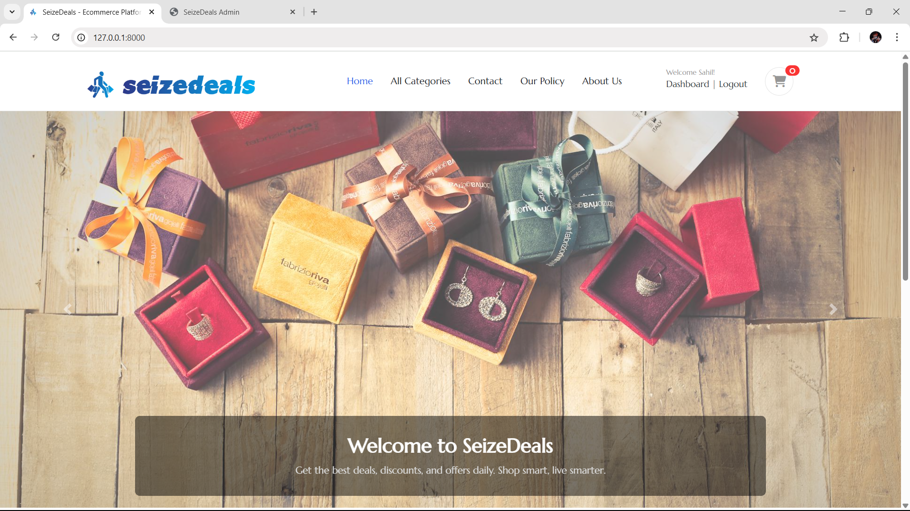
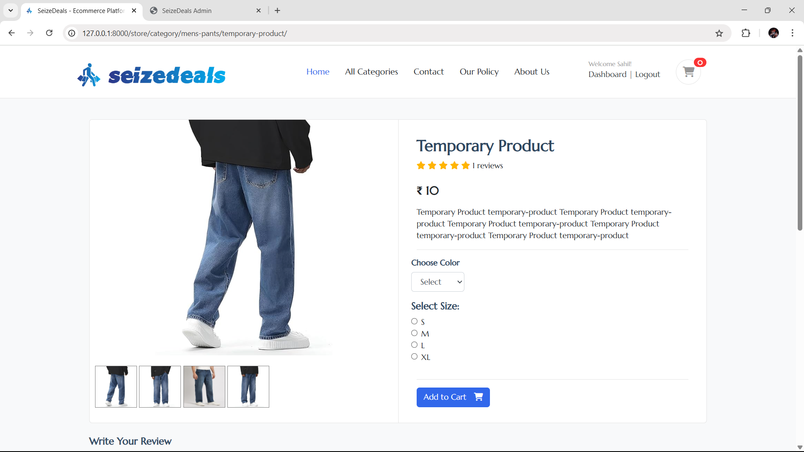
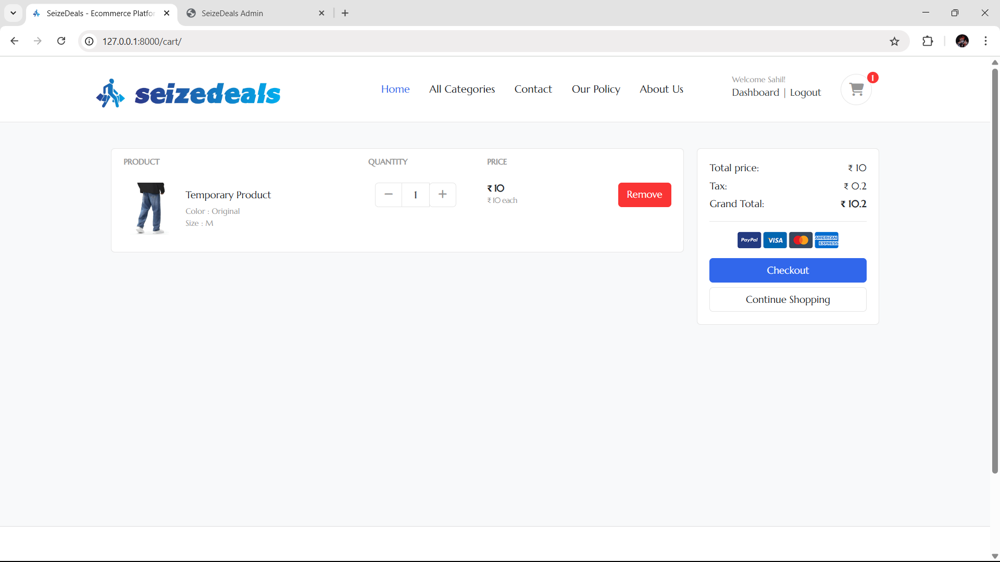
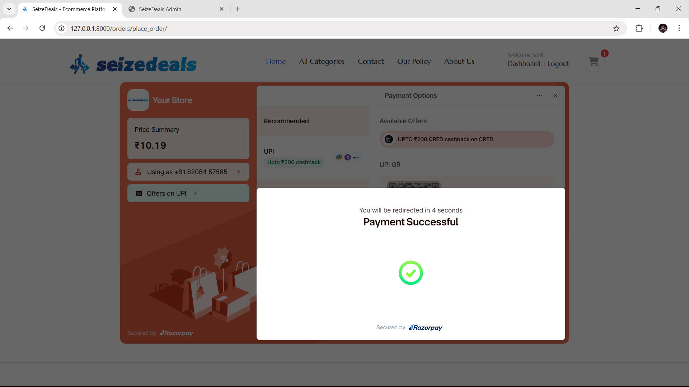
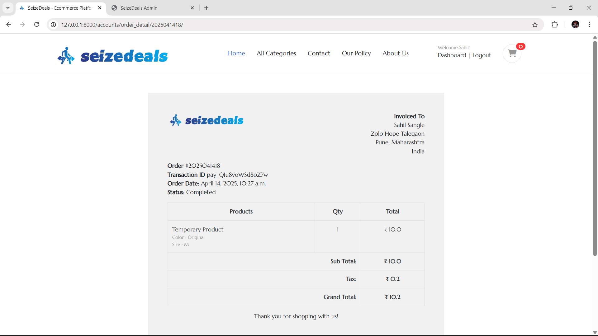
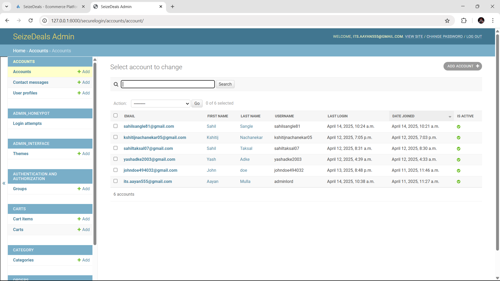

# SeizeDeals - Django E-Commerce Platform

SeizeDeals is a full-stack e-commerce website built with Python and Django. It’s designed to be a complete online store where users can browse products by category, pick different sizes or colors, and buy items securely using Razorpay.

I built this project to handle the entire shopping process, from user accounts and email verifications to order tracking and automated invoices. It also includes a custom admin dashboard with extra security features like a honeypot to keep the backend safe from unauthorized access.

> **Internship Project** - Elite Softwares Pvt. Ltd., Pune | Dec 2024 - Feb 2025

---

## Live Demo

> Coming soon - deployment in progress

---

## Screenshots

| Home Page | Product Detail | Cart |
|-----------|---------------|------|
|  |  |  |

| Payment Gateway | Order Invoice | Admin Dashboard |
|----------------|--------------|----------------|
|  |  |  |

---

## Features

### User
- Secure registration & login with email verification
- User profile management with shipping address
- Browse products by category
- Add to cart with size/color variation selection
- Checkout with Razorpay payment gateway (UPI, Cards, Net Banking)
- Order confirmation & payment emails sent automatically
- Order history and invoice view

### Admin
- Custom admin dashboard (full CRUD for products, categories, orders)
- View registered users and their order/payment status
- Manage contact form submissions
- Role-based access control

---

## Tech Stack

| Layer | Technology |
|-------|------------|
| Backend | Python 3.10+, Django 3.1 |
| Frontend | HTML5, CSS3, Bootstrap 4, JavaScript, jQuery |
| Database | SQLite (dev) / PostgreSQL (prod via AWS RDS) |
| Payment | Razorpay API |
| Email | Django SMTP + Gmail |
| Image Handling | Pillow |
| Storage | AWS S3 (production) |
| Deployment | AWS Elastic Beanstalk ready |

---

## Project Architecture

```
SeizeDeals/
+-- accounts/           # Custom user model, auth, user profiles
+-- store/              # Products, categories, variations, reviews
+-- carts/              # Cart, CartItem, session management
+-- orders/             # Order, OrderProduct, Payment models
+-- seizedeals/         # Django project settings & URLs
+-- templates/          # HTML templates
+-- static/             # CSS, JS, images
+-- media/              # Product images
+-- fixtures/           # Demo data (categories, products, variations)
+-- requirements.txt
+-- .env-sample
```

### Key Design Patterns
- **MVT Architecture** - Django's Model-View-Template pattern
- **OOP** - All core entities modelled as Django classes
- **Session-based Cart** - Works for both guests and logged-in users
- **Razorpay Signature Verification** - Server-side HMAC validation for payment security

---

## Local Setup

### Prerequisites
- Python 3.10+
- pip
- Git

### Steps

**1. Clone the repository**
```bash
git clone https://github.com/yourusername/SeizeDeals.git
cd SeizeDeals
```

**2. Create and activate a virtual environment**
```bash
python -m venv venv

# Windows
venv\Scripts\activate

# macOS / Linux
source venv/bin/activate
```

**3. Install dependencies**
```bash
pip install -r requirements.txt
```

**4. Configure environment variables**
```bash
# Windows
copy .env-sample .env

# macOS / Linux
cp .env-sample .env
```
Then open `.env` and fill in your actual values (see Environment Variables section below).

**5. Apply database migrations**
```bash
python manage.py migrate
```

**6. Load demo data (categories, products, variations)**
```bash
python manage.py loaddata fixtures/initial_data.json
```

**7. Create an admin account**
```bash
python manage.py createsuperuser
```

**8. Run the development server**
```bash
python manage.py runserver
```

Open your browser at: **http://127.0.0.1:8000/**  
Real admin panel: **http://127.0.0.1:8000/securelogin/**  

**Security note:** `http://127.0.0.1:8000/admin/` is a honeypot — it shows a fake login page that logs every access attempt. The real admin is at `/securelogin/`.

---

## Environment Variables

Create a `.env` file in the root directory (use `.env-sample` as reference):

```env
# Django Core
SECRET_KEY=your_django_secret_key
DEBUG=True

# Email (Gmail SMTP)
EMAIL_BACKEND=django.core.mail.backends.smtp.EmailBackend
EMAIL_USE_TLS=True
EMAIL_HOST=smtp.gmail.com
EMAIL_PORT=587
EMAIL_HOST_USER=your_email@gmail.com
EMAIL_HOST_PASSWORD=your_gmail_app_password

# Razorpay Payment Gateway
RAZORPAY_KEY_ID=your_razorpay_key_id
RAZORPAY_KEY_SECRET=your_razorpay_key_secret
```

> **Never commit your `.env` file.** It is already listed in `.gitignore`.

> **Gmail App Password**: To use Gmail SMTP, you need to generate an App Password from your Google Account under Security > 2-Step Verification > App Passwords.

---

## Database Models

### `Account` (Custom User)
Extends `AbstractBaseUser` - uses email as primary login field instead of username.

### `Product` & `Variation`
Products support multiple variations (color, size) linked via `ManyToManyField` on CartItem.

### `Cart` & `CartItem`
Session-based for guests, user-linked for authenticated users. Handles quantity and variation management.

### `Order` & `Payment`
Full order lifecycle: New > Accepted > Completed. Payment stores Razorpay transaction ID and status.

---

## Payment Flow

```
User adds items to cart
        |
Proceeds to checkout (enters shipping details)
        |
Django creates Razorpay Order ID via API
        |
User completes payment (UPI / Card / Net Banking)
        |
Razorpay sends callback -> Django verifies HMAC signature
        |
Order marked as paid -> Confirmation email sent to user
```

---

## Key Modules

| Module | Responsibility |
|--------|---------------|
| `accounts/` | Registration, login, logout, email verification, profile management |
| `store/` | Product listing, category filtering, product detail, ratings & reviews |
| `carts/` | Add/remove/update cart items, session cart, cart context processor |
| `orders/` | Place order, Razorpay integration, invoice generation, email notifications |

---

## Future Enhancements

- [ ] AI-powered product recommendation engine
- [ ] Real-time price comparison across platforms (Amazon, Flipkart)
- [ ] Multi-vendor marketplace architecture
- [ ] Wishlist functionality
- [ ] Advanced search with filters (price range, ratings)

---

## Internship Details

| Field | Details |
|-------|---------|
| Organization | Elite Softwares Pvt. Ltd., Pune |
| Duration | 23rd December 2024 - 8th February 2025 |
| Role | Python-Django Framework Intern |
| Supervisor | Mr. Swami Panjala (Founder & CEO) |
| Certificate | Issued |

---

## Developer

**Aayan Mulla**
BE Computer Engineering (AI & Data Science)
Dr. D. Y. Patil College of Engineering and Innovation, Pune


[](https://github.com/AayanM05)

[](mailto:aayanmulla7777@gmail.com)

---

## License

This project is open source and available under the [MIT License](LICENSE).
